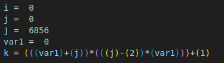
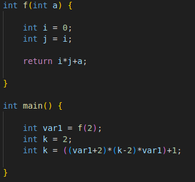
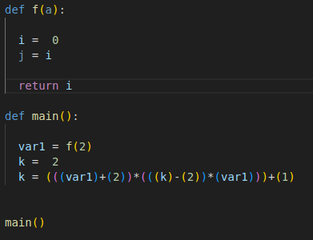
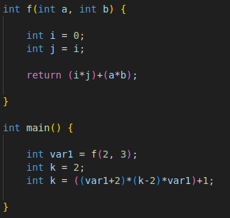
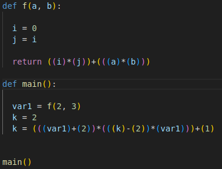
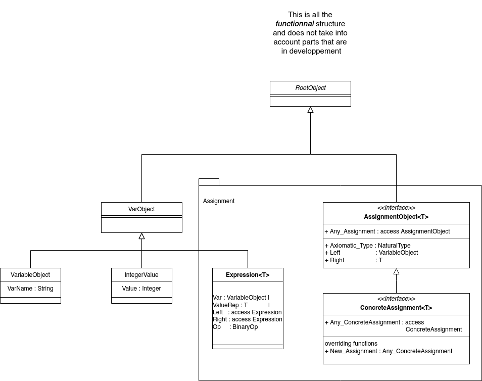

# CPyC

This is a simple C to Python converter.

The goals of this project are numerous.
First, this project more or less came from my desire to learn more about Ada.
As such, there might be more efficient ways to do things; but - at this point in
time - I am not aware of them.
Second, the scope of the project will only be - at most - to manage parsing
functions. That is to say, I will try to translate the following elements :
- Variables Structures
- Control Flow
- Loops (for and while only)
- Functions

I will repeat it just in case, _I do not have the desire to create a full parser,
nor do I absolutely want my solution to be exhaustive or efficient_. First off,
I don't really have the time for that. Second, while I try to do things correctly
by creating a little bit of structure (see UML diagram below), I am well aware
that this is something that I code as I think about it mostly. That is to say,
it is more or less on the fly than anything (well, I do have some notions about
parsing; but hey.)

# Changelog

## 18/02/24 :

with T&nbsp;&nbsp;&nbsp;&nbsp;&nbsp;&nbsp;&nbsp;&nbsp;&nbsp;&nbsp;&nbsp;&nbsp;&nbsp;&nbsp;&nbsp;: int; \
with Value&nbsp;&nbsp;&nbsp;&nbsp;&nbsp;&nbsp;&nbsp;&nbsp;: [0-9]+ \
with Variable&nbsp;&nbsp;&nbsp;&nbsp;: [\w_]+

with E : (T) Variable (= Value);

The Program can now generate variable structure of the form of E

generation table :

| C           | Python |
|-------------|--------|
| int i = 23; | i = 23 |
| int j;      | j = 0  |

## 20/02/24 :

with T&nbsp;&nbsp;&nbsp;&nbsp;&nbsp;&nbsp;&nbsp;&nbsp;&nbsp;&nbsp;&nbsp;&nbsp;&nbsp;&nbsp;&nbsp;: int; \
with Value&nbsp;&nbsp;&nbsp;&nbsp;&nbsp;&nbsp;&nbsp;&nbsp;: [0-9]+ \
with Variable&nbsp;&nbsp;&nbsp;&nbsp;: [\w_]+ \
with Op&nbsp;&nbsp;&nbsp;&nbsp;&nbsp;&nbsp;&nbsp;&nbsp;&nbsp;&nbsp;&nbsp;&nbsp;: [+-*/]

with S :&nbsp;&nbsp;&nbsp;Value&nbsp;&nbsp;&nbsp;&nbsp;&nbsp;| \
&nbsp;&nbsp;&nbsp;&nbsp;&nbsp;&nbsp;&nbsp;&nbsp;&nbsp;&nbsp;&nbsp;&nbsp;&nbsp;&nbsp;&nbsp;Variable | \
&nbsp;&nbsp;&nbsp;&nbsp;&nbsp;&nbsp;&nbsp;&nbsp;&nbsp;&nbsp;&nbsp;&nbsp;&nbsp;&nbsp;&nbsp;S Op S

with E1 : (T) Variable (= S);

The Program can now generate variable structure of the form E1

e.g :
|  |
|:--:|
| *C code* |

|  |
|:--:|
| *Python code Generation* |

### Note :
I am well aware that variable name and values are enclosed in parenthesis as of
right now and I am currently hesitating as to what to do about it. Do I leave it
for the post-processing or do I want to tackle it during the printing process.
Part of me is slightly curving towards post-proc' as it is "another" task that
the printer should not worry about.

## 23/02/24 :

with T&nbsp;&nbsp;&nbsp;&nbsp;&nbsp;&nbsp;&nbsp;&nbsp;&nbsp;&nbsp;&nbsp;&nbsp;&nbsp;&nbsp;&nbsp;: int; \
with Value&nbsp;&nbsp;&nbsp;&nbsp;&nbsp;&nbsp;&nbsp;&nbsp;: [0-9]+ \
with Variable&nbsp;&nbsp;&nbsp;&nbsp;: [\w_]+ \
with Op&nbsp;&nbsp;&nbsp;&nbsp;&nbsp;&nbsp;&nbsp;&nbsp;&nbsp;&nbsp;&nbsp;&nbsp;: [+-*/]

with S :&nbsp;&nbsp;&nbsp;Value&nbsp;&nbsp;&nbsp;&nbsp;&nbsp;| \
&nbsp;&nbsp;&nbsp;&nbsp;&nbsp;&nbsp;&nbsp;&nbsp;&nbsp;&nbsp;&nbsp;&nbsp;&nbsp;&nbsp;&nbsp;Variable | \
&nbsp;&nbsp;&nbsp;&nbsp;&nbsp;&nbsp;&nbsp;&nbsp;&nbsp;&nbsp;&nbsp;&nbsp;&nbsp;&nbsp;&nbsp;S Op S

with E1 : (\<T\>) Variable (= S); \
with Ret: return S;

with Prefix&nbsp;&nbsp;&nbsp;&nbsp;&nbsp;&nbsp;&nbsp;&nbsp;&nbsp;&nbsp;&nbsp;&nbsp;&nbsp;&nbsp;: T  (I will add "if" etc. later) \
with Struct_Name&nbsp;&nbsp;: \w+

with Potential_Args : (\w+)? | ((\w+,)+)\w+ \
with Args&nbsp;&nbsp;&nbsp;&nbsp;&nbsp;&nbsp;&nbsp;&nbsp;&nbsp;&nbsp;&nbsp;&nbsp;&nbsp;&nbsp;&nbsp;&nbsp;&nbsp;: ( Potential_Args )

with Stmt : E1&nbsp;&nbsp;&nbsp;&nbsp;&nbsp;&nbsp;| \
&nbsp;&nbsp;&nbsp;&nbsp;&nbsp;&nbsp;&nbsp;&nbsp;&nbsp;&nbsp;&nbsp;&nbsp;&nbsp;&nbsp;&nbsp;&nbsp;&nbsp;&nbsp;Ret&nbsp;&nbsp;&nbsp;&nbsp;&nbsp;|\
&nbsp;&nbsp;&nbsp;&nbsp;&nbsp;&nbsp;&nbsp;&nbsp;&nbsp;&nbsp;&nbsp;&nbsp;&nbsp;&nbsp;&nbsp;&nbsp;&nbsp;&nbsp;Struct \
with Body : Stmt*\
With Struct : Prefix Struct_Name Args { Body }

The Program can now generate structure of the form Struct or E1

e.g :
|  |
|:--:|
| *C code* |

|  |
|:--:|
| *Python code Generation* |

### Note :

- The note of 20/02 still holds.
- Moreover, "main()" is automatically generated whether a function of the same name is found. Will need to generate it only if such a function is found. (P.I.)
- As of now, calls in expressions are not recognized and will crash the parser. (P.II.)

- Error when parsing (i\*j)+(a*b) (E.I.)
- Cannot parse f(2, 3) (E.II.)

## 25/02/24

- Parser I. done. the main call is now only generated if a main function exist
- Error I. fixed. I just didn't check for string termination and in some cases it just worked.
- Error II.fixed. I was creating variables by taking the last element of the splited row by whitespace. Obviously doesn't work with multiple args.

e.g :
|  |
|:--:|
| *C code* |

|  |
|:--:|
| *Python code Generation* |

# Structure

