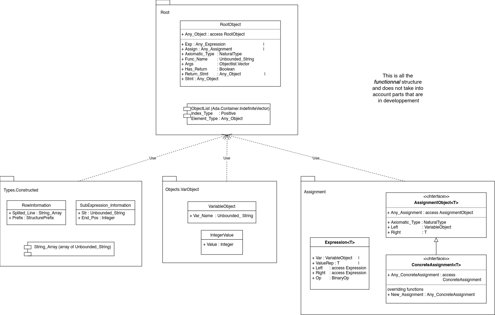

# CPyC

This is a simple C to Python converter.

# Changelog

## 18/02/23 :

with T&nbsp;&nbsp;&nbsp;&nbsp;&nbsp;&nbsp;&nbsp;&nbsp;&nbsp;&nbsp;&nbsp;&nbsp;&nbsp;&nbsp;&nbsp;: int; \
with Value&nbsp;&nbsp;&nbsp;&nbsp;&nbsp;&nbsp;: [0-9]+ \
with Variable&nbsp;: [\w\d]+

with E : (T) Variable (= Value);

The Program can now recognize variable structure of the form of E

generation table :

| C           | Python |
|-------------|--------|
| int i = 23; | i = 23 |
| int j;      | j = 0  |

## 20/02/23 :

with T&nbsp;&nbsp;&nbsp;&nbsp;&nbsp;&nbsp;&nbsp;&nbsp;&nbsp;&nbsp;&nbsp;&nbsp;&nbsp;&nbsp;&nbsp;: int; \
with Value&nbsp;&nbsp;&nbsp;&nbsp;&nbsp;&nbsp;: [0-9]+ \
with Variable&nbsp;: [\w\d]+ \
with Op&nbsp;&nbsp;&nbsp;&nbsp;&nbsp;&nbsp;&nbsp;&nbsp;&nbsp;&nbsp;&nbsp;: [+-*/]

with S : Value&nbsp;&nbsp;&nbsp;&nbsp;&nbsp;&nbsp;| \
&nbsp;&nbsp;&nbsp;&nbsp;&nbsp;&nbsp;&nbsp;&nbsp;&nbsp;&nbsp;&nbsp;&nbsp;&nbsp;&nbsp;&nbsp;Variable | \
&nbsp;&nbsp;&nbsp;&nbsp;&nbsp;&nbsp;&nbsp;&nbsp;&nbsp;&nbsp;&nbsp;&nbsp;&nbsp;&nbsp;&nbsp;S Op S

with E1 : (\<T\>) Variable (= S);

The Program can now recognize variable structure of the form E1

generation table :
| C           | Python      |
|-------------|-------------|
| int i = 23; | i = 23      |
| int j;      | j = 0       |
| i = 32;     | i = 32      |
| i = (k+2)*j | i = (k+2)*j |

# Structure

